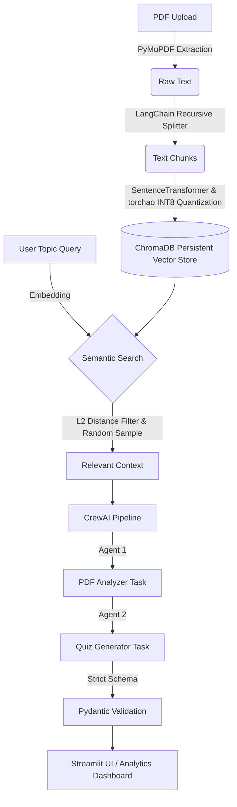

# ✨ Synapse.ai

**Intelligent, AI-Powered Educational Assessment Platform**

Transform any PDF document into a pedagogically-sound, multi-format assessment using RAG, Multi-Agent AI (CrewAI), and Bloom's Taxonomy. Synapse.ai intelligently distributes questions across cognitive levels to ensure a deep, balanced evaluation of knowledge.

---

##  Features

- **RAG-Powered Contextual Grounding:** Questions are generated from your actual document content via robust semantic retrieval using ChromaDB and local SentenceTransformers.
- **Structure-Aware Chunking:** Uses PyMuPDF block-level extraction to preserve paragraph and table boundaries, with sentence-aware text splitting to ensure semantically coherent chunks.
- **Hardware Optimized:** The local embedding model is actively optimized using `torchao` INT8 dynamic quantization (with legacy PyTorch fallback), massively accelerating CPU inference and halving memory footprint.
- **Pedagogically Sound (Bloom's Taxonomy):** Automatically distributes generated questions across the 6 cognitive levels (Remember, Understand, Apply, Analyze, Evaluate, Create) for balanced learning outcomes.
- **Multi-Agent Orchestration:** Utilizes two specialized CrewAI agents that collaborate sequentially: 
  - *PDF Content Analyzer:* Extracts key concepts and themes.
  - *Quiz Generator:* Constructs the quiz adhering strictly to pedagogical frameworks.
- **Multi-Format Assessments:** Supports Multiple Choice (MCQ), True/False, and Short Answer question architectures.
- **Ultra-Premium UI:** Built with Streamlit, featuring a glassmorphic dark-theme design, interactive metrics, and real-time streaming updates.
- **Cognitive Analytics:** Visualizes the difficulty spread and cognitive distribution using interactive Plotly radar and bar charts.

---

##  Architecture Flow



---

##  Tech Stack

| Component | Technology |
|-----------|-----------|
| **Core LLM** | Groq (Llama-3.3 70B Versatile) |
| **Agent Framework** | CrewAI |
| **Vector Database** | ChromaDB (Persistent Local Storage) |
| **Embeddings** | SentenceTransformers (`all-MiniLM-L6-v2`, torchao INT8 Quantized) |
| **Text Processing** | LangChain (sentence-aware splitting) & PyMuPDF (block-level extraction) |
| **Frontend UI** | Streamlit + Custom CSS |
| **Data Viz** | Plotly Express / Graph Objects |
| **Data Validation** | Pydantic |

---

##  Installation & Setup Instructions

Follow these steps to run the application locally.

### 1. Clone the Repository
```bash
git clone <your-repo-url>
cd synapse.ai
```

### 2. Set Up a Virtual Environment (Recommended)
```bash
python -m venv .venv
# On Windows
.venv\Scripts\activate
# On Mac/Linux
source .venv/bin/activate
```

### 3. Install Dependencies
```bash
pip install -r requirements.txt
```
*(Alternatively, you can use `uv` for faster installations: `pip install uv && uv pip install -r requirements.txt`)*

### 4. Configure Environment Variables
You need a Groq API key to power the LLM engine.
1. Get a free API key from [Groq Console](https://console.groq.com/).
2. Create a `.env` file in the root directory:
```env
GROQ_API_KEY=your_groq_api_key_here
```

### 5. Launch the Application
Run the Streamlit frontend:
```bash
streamlit run src/synapse_ai/app.py
```
The application will automatically open in your default web browser at `http://localhost:8501`.

---

##  How to Operate the Application

1. **Upload a Document:** Open the sidebar on the left and upload any educational PDF document. Wait for the *Knowledge Base Synchronized* status.
2. **Define Parameters:**
   - **Focus Topic:** (Optional) Enter a specific topic you want to be quizzed on (e.g., "Photosynthesis"). Leave blank to cover the entire document.
   - **Questions:** Select the number of questions to generate (between 3 and 20).
   - **Level:** Choose the difficulty tier.
   - **Question Architecture:** Select one or more question types (MCQ, True/False, Short Answer).
3. **Synthesize:** Click the **Synthesize Quiz** button. You can monitor the live thoughts of the AI agents via the UI terminal output.
4. **Take the Quiz:** Once generated, take the interactive quiz.
5. **Review Analytics:** After submitting your answers, review your score and cognitive breakdown via the dynamic charts at the bottom.

---

## 📁 Project Structure

```
synapse.ai/
├── .env                          # Environment variables (API Keys)
├── .chroma_store/                # Local persistent vector database
├── requirements.txt              # Project dependencies
├── test.pdf                      # Sample PDF for testing
└── src/
    └── synapse_ai/
        ├── app.py                # Main Streamlit UI application
        ├── rag.py                # Data ingestion, embedding, and retrieval
        ├── crew.py               # CrewAI agents & orchestration logic
        ├── blooms.py             # Bloom's Taxonomy logic & prompt builder
        ├── main.py               # Alternative CLI execution script
        ├── config/               
        │   ├── agent.yaml        # AI agent persona definitions
        │   └── task.yaml         # AI task prompt instructions
        └── models/               
            └── quiz.py           # Pydantic schema validation models
```

---

##  Bloom's Taxonomy Defaults

By default, a standard 10-question quiz is distributed as follows to ensure cognitive balance (scales proportionally for other lengths):

| Level | Count | Focus |
|-------|-------|----------------|
| Remember | 2 | Recall facts, basic concepts |
| Understand | 3 | Explain ideas or concepts |
| Apply | 2 | Use information in new situations |
| Analyze | 2 | Draw connections among ideas |
| Evaluate | 1 | Justify a stand or decision |
| Create | 0 | Produce new or original work |

---

